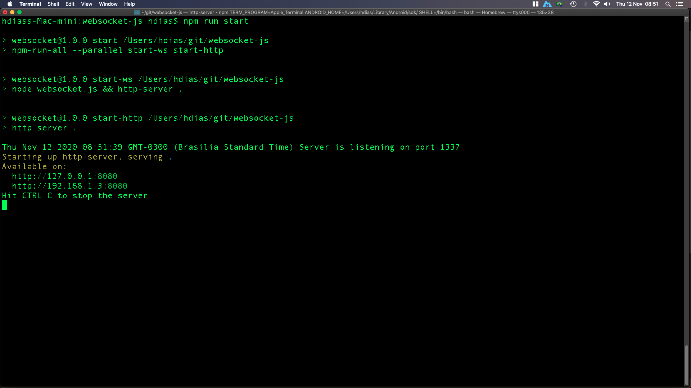
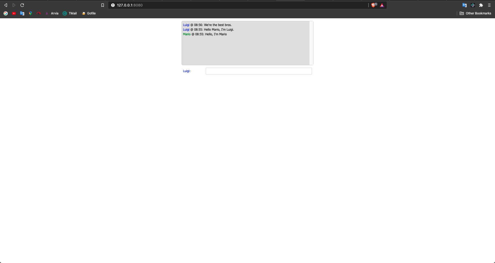
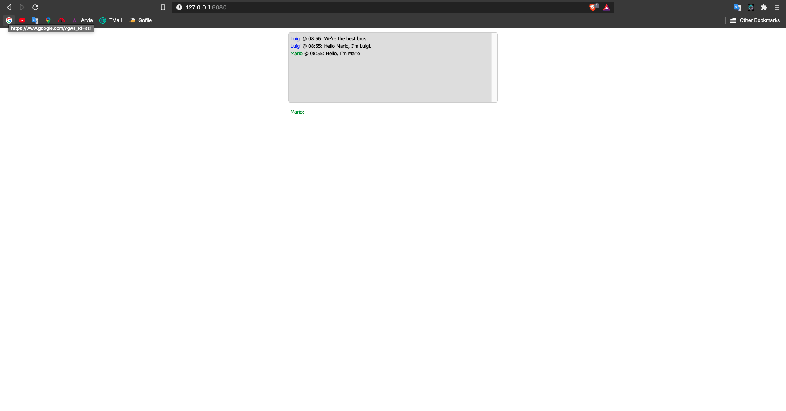

# websocket-js
Test WebSocket with js
<br>
# Setup
```
git https://github.com/stdioh321/websocket-js-chat.git
cd websocket-js
npm install
```
# Run
```
npm run start
```
**Your terminal should display a similar log**



**Open on your browser in 2 or more tabs and start chatting:**<br>
## **http://localhost:8080**
| Chat 1            | Chat 2    |
| :---:             | :---:     | 
|  |  |
<br><br>

# Requirements
1. [Node](https://nodejs.org/en/download/)